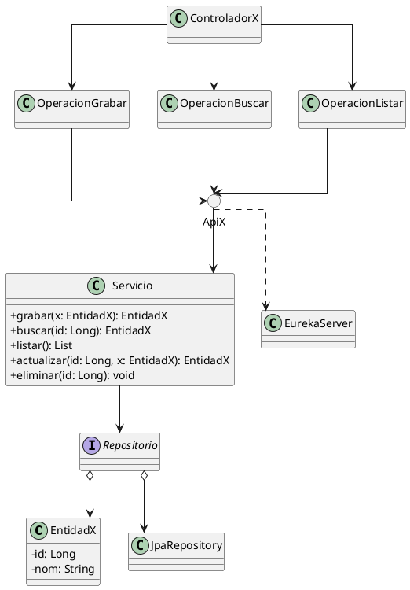
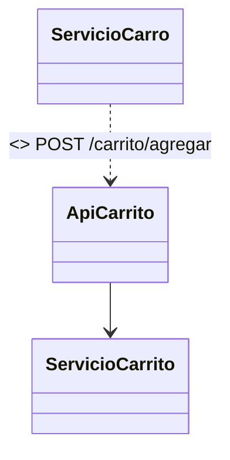

# Convenciones del profesor para diagramas PlantUML/Mermaid en los microservicios

Este documento resume el “patrón” que usa el profesor en los diagramas PUML/Mermaid observados en:

- `diagrams/uml_apiarticulo.puml` y `diagrams/mermaid_apiarticulo.mermaid`
- `diagrams/uml_apicarro.puml` y `diagrams/mermaid_apicarro.mermaid`

y cómo se relacionan con los módulos de ejemplo adjuntos:

- ApiArticuloN → `ApiArticuloN/` (Articulo, Control, Servicio, Repositorio)
- Carrito → `Carrito/` (Linea, Control, Servicio, Repositorio)
- BoletaCarrito → `ArqEmpNBoletaCarrito/` (Boleta, Linea, Control, Servicio)
- ApiBoletaN → `ApiBoletaN/` (Articulo como DTO, Control)

La idea es que puedas replicar estas convenciones para tus propios diagramas.

---

## 1) Capas y artefactos que siempre aparecen

- Entidades de dominio (modelo):
  - Ejemplos: `Articulo`, `Linea`, `Carro`, `Boleta`.
  - Atributos privados con tipo: `-id: Long`, `-nom: String`, `-pre: double`, `-sto: int`.
  - Métodos de dominio cuando aporta valor (p.ej. `+getImporte(): double` en `Linea`).

- Servicio de aplicación (casos de uso):
  - Clase `Servicio` con operaciones públicas como `+grabar(art: Articulo): Articulo`, `+listar(): List`, `+nuevo(): Carro`.
  - En “Carrito/BoletaCarrito” hay varios servicios coordinándose (Carro, Carrito, Boleta), cada uno centrado en su propio agregado/caso de uso.

- Repositorio (persistencia):
  - Interfaz `Repositorio` sin detallar métodos (en Mermaid con `<<interface>>`).
  - Agregación hacia `JpaRepository` (indica uso de Spring Data JPA).
  - Dependencia hacia la Entidad que maneja.

- API del microservicio como “circle”:
  - PUML: `circle ApiNombre` (ej. `circle ApiArticulo`, `circle ApiCarro`).
  - Mermaid: clase con estereotipo `<<circle>>`.

- Controladores y “operaciones” (endpoints):
  - Controladores “front” (p.ej. `Carrito`) apuntan a clases “operación” por verbo: `Grabar`, `Buscar`, `Listar`, `Nuevo`, `Agregar`, `Quitar`.
  - Flujo representado como: Controlador → Operación → API → Servicio → Repositorio.
  - Cuando quiere enfatizar la respuesta, añade clases como `Mensaje`, `Datos`, `Listado`, `Catalogo` conectadas desde la operación.

- Infraestructura externa:
  - `EurekaServer` aparece como dependencia de la API o del Servicio con flecha punteada (descubrimiento de servicios).

Relación con el código adjunto:
- ApiArticuloN: `Articulo.java`, `ApiArticuloNServicio.java`, `ApiArticuloNRepositorio.java`, `ApiArticuloNControl.java`.
- Carrito: `Linea.java`, `Servicio.java`, `Repositorio.java`, `Control.java`.
- BoletaCarrito: `Boleta.java`, `Linea.java`, `Servicio.java`, `Control.java`.

---

## 2) Notación y estilo en PlantUML

- Atributos: `-nombre: Tipo` (privados; tipos simples o `List`).
- Métodos: `+nombre(par: Tipo): Retorno` (públicos; parámetros con nombre y tipo).
- Visibilidad: `+` público, `-` privado, `#` protegido.
- Alias para nombres duplicados: `class "Linea" as Linea2 { ... }`.
- Estilo global:
  - `skinparam linetype ortho` (líneas ortogonales para legibilidad).
  - `skinparam classAttributeIconSize 0` (oculta iconos de atributos).
- API como nodo circular: `circle ApiX`.

Equivalencia en Mermaid:
- Interfaz: `<<interface>>`.
- API circular: `<<circle>>`.
- Operaciones intermedias: a veces renombra (`GrabarOp`, `ListarOp1/2`) para evitar colisiones.

---

## 3) Semántica de relaciones (flechas)

- Flujo principal (invocación): `A --> B`
  - Controlador → Operación → API → Servicio → Repositorio.
- Dependencia suave: `A ..> B`
  - API/Servicio ..> `EurekaServer`, Servicio ..> Entidad (cuando no hay composición).
- Agregación: `A o--> B`
  - `Repositorio o--> JpaRepository`.
- Agregación + dependencia hacia entidad: `Repositorio o..> Entidad`.
- Conexión entre microservicios (HTTP): `ServicioA -- ApiB`
  - En el diagrama de “Carro/Carrito/Boleta” se usa `--` para resaltar “llamada HTTP” hacia otra API.

---

## 4) Patrón de “operaciones” (endpoints)

- Cada endpoint REST se abstrae como una “operación” (clase) con el verbo de la acción: `Grabar`, `Buscar`, `Listar`, `Nuevo`, `Agregar`, `Quitar`.
- El Controlador (p.ej. `Carrito`) apunta a varias operaciones y éstas desembocan en la API del MS correspondiente.
- Si la misma palabra se usa en varios contextos, se usa alias o nombres distintos (`Listar1`, `Listar2`).
- Opcionalmente, la operación se conecta con una “vista de respuesta” (`Mensaje`, `Datos`, `Listado`).

Beneficio: separa visualmente “entrada HTTP” (operación/API) del “caso de uso” (Servicio) y la “persistencia” (Repositorio/Entidad).

---

## 5) Cómo mapearlo desde el código (ejemplos reales del repo)

- ApiArticuloN (`ApiArticuloN/`):
  - Entidad: `Articulo` con `id`, `nom`, `pre`, `sto`.
  - Servicio: `ApiArticuloNServicio` con operaciones CRUD.
  - Repositorio: `ApiArticuloNRepositorio` (Spring Data JPA → `JpaRepository`).
  - Controlador: `ApiArticuloNControl` (endpoints REST).
  - Diagrama: `ApiArticulo` como círculo; Controladores/Operaciones (`Grabar`, `Buscar`, `Listar`) → `ApiArticulo` → `Servicio` → `Repositorio` → `JpaRepository` → `Articulo`. Dependencia con `EurekaServer`.

- Carrito (`Carrito/`) y BoletaCarrito (`ArqEmpNBoletaCarrito/`):
  - Carrito: `Linea` (entidad), `Servicio`, `Repositorio`, `Control`.
  - BoletaCarrito: `Boleta`, `Linea`, `Servicio`, `Control`.
  - Diagrama: tres APIs circulares (`ApiCarro`, `ApiCarrito`, `ApiBoletaCarrito`), con servicios que se llaman entre sí vía `ServicioX -- ApiY`. Persistencia en `ServicioCarrito` → `Repositorio` → `JpaRepository` y dependencia a `EurekaServer`.

---

## 6) Plantillas rápidas (PUML)

Microservicio CRUD simple:



Interacción entre microservicios (Carro ↔ Carrito ↔ Boleta):

```plantuml
@startuml CarroYCarrito
skinparam classAttributeIconSize 0
skinparam linetype ortho

class Linea { -id: Long -nom: String -pre: double -can: int +getImporte(): double }
class Carro { -tot: double -ces: List }
class Boleta { -fec: String -tot: String -lis: List }

class "Servicio" as ServicioCarro {
  +agregar(lin: Linea): Carro
  +quitar(id: Long): Carro
  +nuevo(): Carro
}
class "Servicio" as ServicioCarrito {
  +agregar(lin: Linea): Linea
  +quitar(id: Long): void
  +listar(): List
  +total(): double
  +nuevo(): void
}
class "Servicio" as ServicioBoleta { +nuevo(): Boleta }

interface Repositorio
class JpaRepository
class EurekaServer
circle ApiCarro
circle ApiCarrito
circle ApiBoletaCarrito

class CarritoCtrl
class Nuevo
class Agregar
class Quitar

CarritoCtrl --> Nuevo
CarritoCtrl --> Agregar
CarritoCtrl --> Quitar
Nuevo --> ApiCarro
Agregar --> ApiCarro
Quitar --> ApiCarro

ApiCarro --> ServicioCarro
ApiCarrito --> ServicioCarrito
ApiBoletaCarrito --> ServicioBoleta

ServicioCarro -- ApiCarrito
ServicioBoleta -- ApiCarrito

ServicioCarrito --> Repositorio
Repositorio o--> JpaRepository
Repositorio o..> Linea

ServicioCarrito ..> EurekaServer
@enduml
```

---

## 7) Reglas prácticas al aplicarlo

- No satures con todos los campos; prioriza los atributos relevantes al caso de uso.
- Nombra las operaciones por verbo del endpoint: `Grabar`, `Listar`, `Buscar`, `Nuevo`, `Agregar`, `Quitar`.
- Manten la semántica de flechas:
  - `-->` para flujo de invocación interno.
  - `--` para conexión HTTP entre microservicios.
  - `..>` para dependencias de infraestructura o suaves (Eureka, DTO).
  - `o-->` (agregación) hacia `JpaRepository`; `o..>` hacia la Entidad desde el Repositorio.
- Si repites nombres de clase en el diagrama, usa alias (`as Nombre2`).
- En Mermaid puedes replicar todo lo anterior (interfaz, circle, operaciones con nombres alternos).

---

## 8) Cómo usarlo en tus MS de clínica (opcional)

- Dibuja `circle` para cada MS: `ApiPaciente`, `ApiMedico`, `ApiHorarioMedico`, `ApiProgramacionMedica`, `ApiCarritoHorario`, etc.
- Para cada MS, muestra: Entidad principal → Servicio → Repositorio → JpaRepository; Operaciones/Control → API → Servicio.
- Inter-llamadas:
  - `ServicioProgramacionMedica -- ApiCarritoHorario`
  - `ServicioCarritoHorario -- ApiHorarioMedico`
  - `ServicioHorarioMedico -- ApiMedico`
- Añade `..> EurekaServer` donde corresponda.

Con estas reglas, podrás mantener consistencia con el estilo del profesor en todos tus diagramas.

---

## 9) Conexiones HTTP entre microservicios: ¿`--`, `-->` o `..>`?

En los ejemplos del profesor se usa `--` (línea sólida sin flecha) entre servicios y APIs remotas para denotar “existe una conexión HTTP”. Eso es válido como simplificación visual. Si quieres precisar mejor la semántica, te propongo estas opciones equivalentes y cuándo elegir cada una:

- Dependencia dirigida (recomendado):
  - `ServicioA ..> ApiB : <<HTTP>>`  (flecha discontinua con etiqueta)
  - Semántica: A “usa”/depende de la API de B en tiempo de ejecución. La línea discontinua enfatiza acoplamiento más débil que una asociación estructural. Puedes añadir el endpoint: `: <<HTTP>> GET /recurso`.

- Asociación dirigida (invitación/llamada):
  - `ServicioA --> ApiB : <<REST>>`
  - Semántica: A “navega” hacia B; sólida y con flecha si quieres mostrar dirección de llamada de forma más fuerte.

- Conexión sin dirección (solo presencia):
  - `ServicioA -- ApiB`
  - Úsala cuando el énfasis es “hay comunicación”, sin comprometer dirección (o por limpieza visual). Añade una etiqueta para evitar ambigüedad: `: HTTP`.

Reglas prácticas:
- Si sabes quién llama a quién, usa dirección (`..>` o `-->`). Si solo quieres indicar vínculo, `--` con etiqueta.
- Prefiere `..>` con `<<HTTP>>` para expresar “uso” en clase/relación estática; reserva `-->` para flujos internos (Controlador/Operación → API → Servicio → Repositorio) o si quieres remarcar la invocación.
- Para llamadas potencialmente bidireccionales, dibuja ambas flechas o usa `--` con nota “bidireccional”.

Ejemplo PUML:

```plantuml
ServicioCarro ..> ApiCarrito : <<HTTP>>\nPOST /carrito/agregar
ApiCarrito --> ServicioCarrito
```

Ejemplo Mermaid:



Con esto evitas confundir la “conexión HTTP” con relaciones estructurales (agregación/composición) y mantienes consistente el uso de flechas en todo el modelo.
